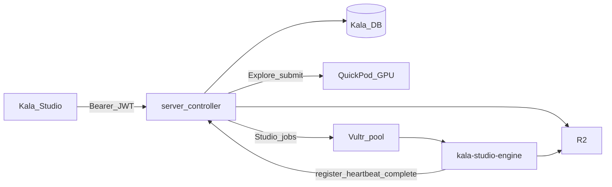
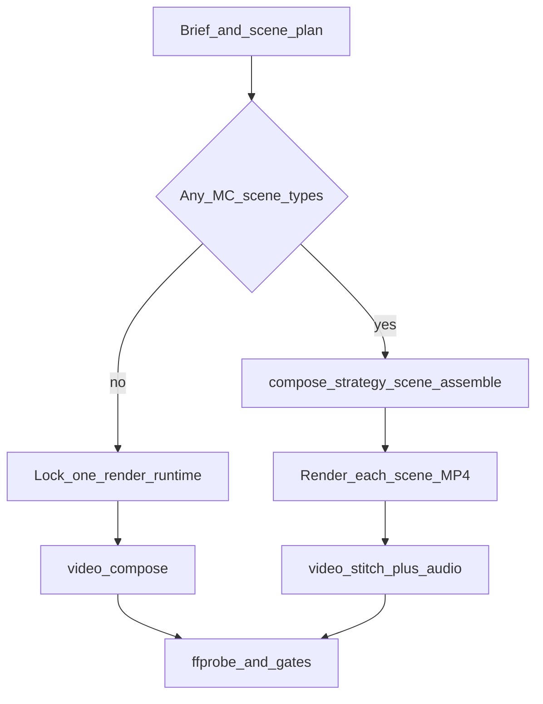
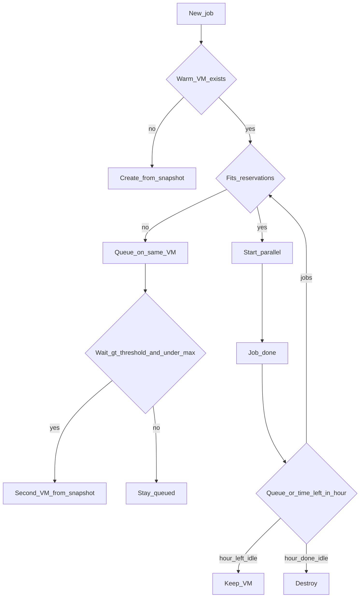

# Product spec / bible

**Status:** locked source of truth for build.  
**Last updated:** 2026-09-09 (repos: this tree is `kala-studio-engine`; API is genedit `server_controller`)  
**This file, not chat history, is what we implement.**

This document specifies the **Studio** product: topic / footage / preferences → reviewed scenes → finished MP4. It covers the product, OpenMontage engine contract, Motion Canvas quality path, Gemini job runner, Vultr capacity manager, lean snapshot, pluggable TTS, AGPL split, costs, APIs, failure modes, and how Studio extends the existing **Kala** Flutter app.

---

## 0. How to use this document

- **Do** implement against this file.
- **Do not** silently shrink v1 to “explainer only.” v1 **product** = all named OpenMontage YAML pipelines (section 5). Build **order** is section 18.
- **Do not** install Blender or promise cinematic 3D worlds in v1 (section 6).
- **Do not** start a new Flutter app. Extend Kala (section 15).
- GPU image / video / Whisper (and any other GPU-class work) is **API-only** on the default Vultr CPU box.

### 0.1 Sources (OpenMontage `main`, verified)

| Source | Why it matters |
|---|---|
| [OpenMontage README](https://github.com/calesthio/OpenMontage) | Pipelines, Remotion vs HyperFrames, zero-key path, Backlot storyboard |
| [PROJECT_CONTEXT.md](https://github.com/calesthio/OpenMontage/blob/main/PROJECT_CONTEXT.md) | Agent-first: **no Python orchestrator**; tools + YAML + skills only |
| [docs/ARCHITECTURE.md](https://github.com/calesthio/OpenMontage/blob/main/docs/ARCHITECTURE.md) | Runtime-aware `video_compose`; pipeline list |
| [skills/core/hyperframes.md](https://github.com/calesthio/OpenMontage/blob/main/skills/core/hyperframes.md) | `renderer_family` vs `render_runtime`; silent swap is CRITICAL |
| [skills/meta/animation-runtime-selector.md](https://github.com/calesthio/OpenMontage/blob/main/skills/meta/animation-runtime-selector.md) | Lock runtime at proposal |
| [tools/video/video_compose.py](https://github.com/calesthio/OpenMontage/blob/main/tools/video/video_compose.py) | Routes remotion / hyperframes / ffmpeg |
| [tools/graphics/blender_world.py](https://github.com/calesthio/OpenMontage/blob/main/tools/graphics/blender_world.py) | `LOCAL_GPU`, ~6 GB VRAM, Blender 4.5 Eevee Next |
| [tools/graphics/threejs_world.py](https://github.com/calesthio/OpenMontage/blob/main/tools/graphics/threejs_world.py) | World spec workspace; `blockout` vs `production`; render is HyperFrames/`video_compose` |
| [pipeline_defs/hybrid.yaml](https://github.com/calesthio/OpenMontage/blob/main/pipeline_defs/hybrid.yaml) | Hybrid = source footage + support graphics, usually one Remotion pass |
| [pipeline_defs/documentary-montage.yaml](https://github.com/calesthio/OpenMontage/blob/main/pipeline_defs/documentary-montage.yaml) | Locks `render_runtime: remotion` for end-tag overlay until HF parity |
| [3d-asset-generation skill](https://github.com/calesthio/OpenMontage/blob/main/.agents/skills/3d-asset-generation/SKILL.md) | Three.js plans; Blender shoots production worlds |
| [threejs-world-generation](https://www.skills.sh/calesthio/openmontage/threejs-world-generation) | Blockout must not be sold as production |
| [Backlot (README)](https://github.com/calesthio/OpenMontage) | Storyboard / asset gate **before** final render |

**Three codebases (locked):**

| Repo (folder today) | Public name | What it is |
|---|---|---|
| **This repo** (`d:\Github\Video Studio SAAS`) | **`kala-studio-engine`** (rename; **not published to git yet**) | Public **AGPL** OpenMontage fork: job runner, MC adapter, snapshot bake, this bible, job contracts. **Runs on the Vultr VM.** No Flutter, no genedit, no secrets. |
| [`image_vid_gen_edit_frontend`](d:\Github\image_vid_gen_edit_frontend) | Kala Flutter | Closed. Studio UI in `lib/features/studio/`. |
| [`image_video_gen_edit_backend`](d:\Github\image_video_gen_edit_backend) | Genedit | Closed. `backend/server_controller/` = live API (`https://genedit.mooo.com`): `/studio/*`, credits, R2, FCM, Vultr create/destroy. GPU worker trees stay here for Explore only. |

Do **not** add a fourth “docs only” repo. Do **not** copy `server_controller` into this engine repo. ToS later links **`kala-studio-engine`**.

Kala package name: `kala_ai_create_images_videos_with_ai`.

### 0.2 What to follow (one bible, one plan)

- **This file** = product and architecture. If chat disagrees with this file, this file wins.
- **One implementation plan** = ordered tasks, file lists, Done when, which of the three repos to open. Cursor plan name: **Studio single implementation**. Older Cursor plans (`studio_e2e_implementation`, `kala-studio-engine lock`) are **superseded**; do not follow them.
- Build **order** is section 18 (phases 0→6). Do not start Kala until genedit `/studio/jobs` works. Do not start genedit `/studio` until the engine can produce a smoke MP4.
- **Git:** before touching a repo, `git fetch` latest `main` and create a **new feature branch**. Do not commit on `main`. Engine is not published yet: after importing OpenMontage `main`, still work on a local feature branch (no `git push` until asked).

Each task touches **exactly one** repo unless the task says “contract” (schema copied, not source merged).

This is **not legal advice**. AGPL split in section 16 is an engineering layout; get a lawyer before charging.

---

## 1. Product

**Name (working):** Studio (feature inside Kala). Consumer UI never says “OpenMontage.”

**Promise:** The user enters a **topic**, optionally **uploads or pastes media**, sets **pipeline preferences**, optionally **reviews each scene**, and gets a **1080p MP4**.

**Client:** Studio is a **new feature** in the existing Kala Flutter app. Optional later: a Cloudflare Pages marketing site. The marketing site is not the product.

**What the user never sees:** Cursor / Claude as the control plane, OpenMontage Backlot UI, Motion Canvas editor, writing TypeScript, “powered by OpenMontage” on the hero. We **do** copy Backlot’s *idea*: a storyboard, approve or regenerate one scene, then stitch.

**Auth:** Reuse Kala Firebase Auth, credits, FCM, Result Manager. Do not rebuild login. Engine can accept a Kala user id / Firebase JWT on Studio jobs.

---

## 2. Goals and non-goals

### 2.1 Goals (v1 product contract)

- All **named YAML pipelines** on OpenMontage `main` (section 5).
- Motion Canvas only where it **raises quality** (diagram / code / math / narration sync / maps).
- Scene **review** before final MP4 (default); Auto mode as a toggle.
- Sparse jobs: Vultr **snapshot + destroy**, with **reuse** and **capacity-first** packing (section 11).
- Image / video gen / Whisper / other GPU work: **APIs only**.
- Pluggable TTS: Piper + one voice now; swap later without rewriting pipelines.

### 2.2 Non-goals (v1)

- Blender 4.5 binary, Eevee world flythroughs, “one prompt 3D world” as a shipped feature.
- Local Wan / Hunyuan / CogVideo / LTX / local Whisper / local diffusion.
- Always-on Vultr (unless jobs fill most hours; then same 6/16 plan, no VX1).
- Explore-style “pick a Kling model → one clip” as the Studio UX (that stays Explore).
- New auth stack, new credits ledger from zero (meter Studio on existing Kala credits).

---

## 3. Architecture

```
Kala Flutter (Studio feature)
    → genedit server_controller  (https://genedit.mooo.com /studio/*)
         existing DB = users, credits, jobs
         existing R2 = uploads, storyboard, final.mp4
         existing FCM
    → Vultr instance pool (0..MAX), one snapshot of kala-studio-engine
         job runner + OpenMontage tools
         LLM / TTS / image / video / Whisper APIs
         PUT artifacts to R2; heartbeat / job_complete back to genedit
```

Explore still uses `/submit` → QuickPod GPU. Studio never uses QuickPod.

**Rules**

- The app **never** SSHs to Vultr. Only **genedit** holds `VULTR_API_KEY`.
- Genedit **never** waits for a full render (short request; job is async).
- Job JSON to the VM is **sanitized**: pipeline, prefs, R2 URLs. No emails, no Stripe IDs.
- This engine repo stays AGPL-clean: no Kala source, no Firebase service accounts.



| Layer | Choice |
|---|---|
| Client | Existing Kala Flutter + `features/studio/` |
| API | Genedit `server_controller` (`/studio/*`, same host as Explore) |
| Jobs / users / credits | Existing SQLAlchemy DB |
| Files | Existing R2 |
| Compute (Studio) | Vultr Cloud Compute **6 vCPU / 16 GB / 320 GB** (`$0.11/hr`, `$80/mo` cap if left on) |
| Image | Ubuntu golden **snapshot** of **this** engine; create/destroy from genedit |
| Brain | Gemini Flash (or swap) **tool-calling** job runner **in this repo** |
| GPU-class | **APIs only** on the Vultr box; Explore GPUs stay QuickPod |
| Compose | Remotion, HyperFrames, FFmpeg, Motion Canvas |

Upgrade to **8 vCPU / 32 GB** only if measured 2–3 overlapping `chrome_heavy` jobs OOM or thrash on 6/16.

---

## 4. Caps

| Cap | Value |
|---|---|
| Default output | 1080p30 |
| 4K | Not default (2–4× render time) |
| Max duration | 20 minutes unless raised later |
| `MAX_INSTANCES` | Start at **2** |
| `chrome_heavy` slots per 6/16 VM | **1** until measured; then at most **2** |
| Platform profiles | YouTube 16:9, Shorts/Reels/TikTok 9:16, IG 1:1, LinkedIn 16:9, cinematic 21:9 |

---

## 5. Pipelines (all in the product)

From OpenMontage `pipeline_defs/` on `main`. `framework-smoke` is **internal tests only**.

| Pipeline | User gives | Output |
|---|---|---|
| `animated-explainer` | Topic | Research → script → visuals → narration → captions |
| `animation` | Topic / brief | Motion graphics, kinetic type |
| `character-animation` | Brief | Local SVG/GSAP characters via HyperFrames |
| `cinematic` | Topic / brief | Trailer / teaser (often needs **video APIs**) |
| `documentary-montage` | Topic / tone | Real stock/archive, CLIP search; no gen-video required |
| `screen-demo` | Script / steps | Terminal / UI walkthrough |
| `avatar-spokesperson` | Script | Avatar presenter (API tools if keys) |
| `talking-head` | User video | Edit + graphics on their footage |
| `hybrid` | User video + brief | Footage + generated **support** graphics |
| `clip-factory` | Long video | Batch short clips |
| `podcast-repurpose` | Audio / video | Audiogram / highlight clips |
| `localization-dub` | Video + target language | Subs / dub |

**None of these YAML pipelines require Blender.**

Cinematic / avatar quality **without** gen-video keys is limited (stills + Remotion, or fail the delivery promise honestly). Documentary + explainer + screen-demo + character-animation + clip-factory + dub must work on the **zero-GPU-model** snapshot.

---

## 6. Blender, `threejs_world`, and HyperFrames atelier (plain language)

### 6.1 Blender is a tool, not a pipeline

[`blender_world.py`](https://github.com/calesthio/OpenMontage/blob/main/tools/graphics/blender_world.py) assembles GLBs and renders with **Blender 4.5 LTS / Eevee Next**. OpenMontage tags it:

- `runtime = ToolRuntime.LOCAL_GPU`
- `ResourceProfile(cpu_cores=8, ram_mb=8192, vram_mb=6000, disk_mb=20000)`

That is the “One Prompt Built This Complete 3D World” **film renderer**. Our default Vultr box is **CPU-only**. **Do not install Blender on the golden snapshot.** 3D world flythroughs are **out of v1**.

Fork may still contain `blender_world` **code**; `doctor` → UNAVAILABLE. Later: GPU SKU + second snapshot.

`atlas_3d` / `fal_3d` (API meshes) stay unused until that SKU. Keys never baked into the snapshot.

### 6.2 What `threejs_world` is

[`threejs_world.py`](https://github.com/calesthio/OpenMontage/blob/main/tools/graphics/threejs_world.py) **plans a 3D set**. It writes a world spec and an editable Three.js workspace. It does **not** by itself emit the pretty final MP4. Rendering is `video_compose` / `hyperframes_compose`.

Same set, two **fidelity** labels ([threejs-world-generation](https://www.skills.sh/calesthio/openmontage/threejs-world-generation)):

| Tier | Meaning | Ship as final? |
|---|---|---|
| **`blockout`** | Gray boxes / simple shapes. Director previz: “is the village left of the river?” | **No.** Never sell as production. |
| **`production`** | Real GLB models (catalog + optional API meshes), PBR terrain | Preview in Three.js; **film-quality shoot is Blender** |

### 6.3 What “HyperFrames atelier” means

HyperFrames = HTML + GSAP in Chrome → MP4 ([hyperframes.md](https://github.com/calesthio/OpenMontage/blob/main/skills/core/hyperframes.md)).

| Mode | Meaning |
|---|---|
| **Templated / cut-schema** | Job runner fills a timeline from `edit_decisions.cuts[]` (typical character-animation / kinetic type). |
| **Atelier** | **Custom** `index.html` + GSAP, maybe **embedded Three.js**. Workshop piece, not a fill-in-the-blanks template. Chrome recording of that page **does not need Blender**. Quality is “good WebGL,” not Eevee lighting. |

**Phrase decoded:** Three.js = layout / optional browser 3D inside HyperFrames. Blender = optional film camera. Skipping Blender **does not** remove explainer, documentary, or other YAML pipelines. It only drops **reference-grade 3D worlds**.

v1: `threejs_world` / 3D APIs remain in the fork; **not advertised**, **not required** on the snapshot.

---

## 7. Render runtime vs hybrid pipeline vs scene assemble

OpenMontage splits ([hyperframes.md](https://github.com/calesthio/OpenMontage/blob/main/skills/core/hyperframes.md)):

- **`renderer_family`** — creative grammar (`explainer-data`, `cinematic-trailer`, `documentary-montage`, …).
- **`render_runtime`** — engine: `remotion` | `hyperframes` | `ffmpeg`. We add **`motion_canvas`**.

Both lock at **proposal** and copy into `edit_decisions`. **Silent swap is a CRITICAL governance bug.** If a runtime fails, surface a blocker and log `render_runtime_selection` before changing.

### 7.1 What `render_runtime` means

It is **which program draws the timeline**, not which AI model.

| Runtime | Use |
|---|---|
| **Remotion** | Explainers, cards, charts, word-level captions, TalkingHead, documentary end-tag overlay (OM lock today) |
| **HyperFrames** | Kinetic type, product promo, character-animation SVG/GSAP, website-to-video |
| **FFmpeg** | Pure concat/trim/dub; stitch after per-scene renders |
| **Motion Canvas** | Diagrams, code, math, narration-synced motion, maps/timelines |

The Flutter user does **not** pick Remotion vs Motion Canvas on the happy path. Advanced override later. Default: job runner chooses from pipeline + scene types.

### 7.2 The `hybrid` pipeline is not “mix engines”

[`hybrid.yaml`](https://github.com/calesthio/OpenMontage/blob/main/pipeline_defs/hybrid.yaml): **user footage + support graphics** (interview + diagrams, product clip + overlays). Compose is usually **one** runtime: Remotion so source + React overlays are one pass; HyperFrames only if support is HTML/GSAP.

### 7.3 Scene-level assemble (optional compose strategy)

Different from the hybrid **pipeline**:

1. `scene_plan` tags scenes: `broll` | `diagram` | `code` | `math` | `title` | `end_tag` | …
2. Each scene renders to a short MP4 with the **best engine for that scene**.
3. FFmpeg `video_stitch` concatenates + mixes audio/captions.

**Auto trigger (not a user toggle):**

- Pipeline is documentary / explainer / hybrid **and**
- `scene_plan` has **≥1** diagram, map, etymology, timeline, code, or math scene **and**
- Motion Canvas `doctor` is OK.

Otherwise **single-runtime** (OpenMontage default).

**Quality:** mixing helps **only** those scene types. Mixing every card into Motion Canvas adds cost and breakage.

**Pros:** right tool per beat; `video_stitch` exists; retry one scene without re-rendering 10 minutes of B-roll; filmstrip review is natural.

**Cons:** fps/color/audio clock must be normalized (1080p30, same LUT); karaoke captions across cuts are harder than one Remotion timeline; documentary **locks remotion** for end-tag ([documentary-montage.yaml](https://github.com/calesthio/OpenMontage/blob/main/pipeline_defs/documentary-montage.yaml)). Scene-assemble is an **intentional extension**: log `compose_strategy: scene_assemble` + `scene_runtimes[]`. Never silent-swap.

**Do not** run two engines in one Chromium. One engine per scene file, stitch after. Primary `render_runtime` = engine for **majority duration**. Reviewer treats unlogged mixed engines as CRITICAL.



---

## 8. Motion Canvas — exact upgrades

Not a second studio. `render_runtime: motion_canvas` for a whole job **or** per-scene in `scene_assemble`.

| Upgrade | How | What the user sees |
|---|---|---|
| Layout + signals | Generated MC project from `scene_plan` | Diagrams **move**, not fading stills |
| Code (Lezer) | `code_snippet` → MC Code | Type-on, highlight, cursor |
| Latex | Math beats → Tex | Equations build with the voice |
| `waitUntil` / time events | TTS word timestamps → MC events | Hits **narration**, not a fixed 3s card |
| SVG / vector | Maps, etymology, timelines | Motion graphics over documentary B-roll |

**Do not use MC for:** editor UI, player-as-app, Remotion captions/TalkingHead, HyperFrames character rigs, FFmpeg concat.

**Selector (runner, not user):**

- Explainer/animation with diagram/code/math majority → whole job MC **or** Remotion + MC inserts.
- Character-animation → `hyperframes` only.
- Talking-head / captions-heavy → `remotion`.
- Clip-factory / dub / pure trim → `ffmpeg`.
- Documentary body → Remotion/FFmpeg footage; MC only title/map/timeline scenes if present.

---

## 9. How the MP4 is made, and scene review

### 9.1 Engine path (every pipeline)

```
idea/brief → script → scene_plan → assets (clips, stills, TTS)
  → edit_decisions (cut list) → compose → final.mp4
```

Compose is `video_compose`: locked runtime writes `projects/<id>/renders/final.mp4`. Locally, the IDE agent also pauses on **Backlot**: script gate, **storyboard contact sheet** (takes per scene), then render ([README Backlot](https://github.com/calesthio/OpenMontage)).

### 9.2 Review mode (Studio default)

Users **can and should** see scenes before the final MP4.

Engine `run_job` defaults to `review_mode: true`. That returns `status: "review"` plus `project/artifacts/storyboard.json` — the filmstrip payload Kala polls. Each scene carries poster/preview paths (R2 keys later), `qa_status` / `qa_issues` from Gemini vision, and `atelier_slug` / `composition_id` when the cut was authored as atelier.

1. Runner stops after per-scene MP4s (and visual QA + at most one rewrite).
2. Runner writes **storyboard** (also on auto-stitch jobs, so Kala can still show a timeline after `done`). Genedit may upload it to R2 and store the job in `REVIEWING`.
3. Kala shows a filmstrip. User can:
   - **Approve** the scene
   - **Regenerate** this scene only (`regenerate_scene_id` + optional `prefs.regen_prompt`)
   - **Replace** with Explore output or camera roll
   - **Edit copy** (title, caption) without re-research
   - **Open in Editor** — scene MP4s on the existing Kala timeline
4. **Continue** (`continue_after_review`) → stitch approved scenes → `final.mp4`.

**Atelier regen must not fall back to the Explainer catalog.** If `composition_mode` is atelier, the engine patches `Composition.tsx` for that scene, re-renders the master, and ffmpeg-splits that time range. A catalog `hero_title` card is a bug.

**Auto mode:** local `demo_studio` stitches `final.mp4` unless `--review`. Production jobs keep `review_mode: true` in the contract.

### 9.3 Capacity during review

Do **not** hold the Vultr VM while the user thinks. Upload storyboard, **release slots**. Keep the VM only if still inside the paid hour and other jobs need it. Regenerating one scene = a short new job (warm VM if still up).

### 9.4 Single-runtime jobs

If the whole video is one Remotion composition, still extract **per-scene preview frames** (optional `--frames` range) for the filmstrip. Regenerating one scene is heavier than `scene_assemble`. Prefer scene-assemble when review + regenerate is expected.

### 9.5 OpenMontage compatibility

Checkpoints already exist. SaaS runner persists `human_approval` on `assets` and a `scene_review` stage. Same artifact names: `brief`, `script`, `scene_plan`, `asset_manifest`, `edit_decisions`, `render_report`.

---

## 10. LLM job runner (Gemini replaces the IDE agent for customers)

[PROJECT_CONTEXT.md](https://github.com/calesthio/OpenMontage/blob/main/PROJECT_CONTEXT.md): **the agent IS the intelligence. There is no Python orchestrator.** Cursor is required for the **upstream** repo, not for SaaS.

**SaaS must add a job runner.** Faithful replacement = LLM **plus** hard Python, not “dump the repo into Gemini.”

| Layer | Who |
|---|---|
| Load pipeline YAML, stage order, JSON schemas | Python |
| Retrieve **this stage’s** director skill + playbook + tool schemas (not 700 files) | Python |
| Creative choices (script, scenes, scored provider pick) | **Gemini Flash** (or swap) with tool calling |
| `execute()` on Python tools | Python |
| Schema validate, slideshow gate, ffprobe | Python |
| Scene review | Kala UI + checkpoint |

**Not faithful:** one-shot “write a video”; ignore YAML; skip tools.  
**Faithful:** stage loop = read skill → model proposes tool calls → tools run → checkpoint → next stage.

Default model: Gemini Flash. Swappable (`OPENAI_API_KEY`, etc.). Cost/latency on the genedit job row / logs.

IDE agents remain for **developing** the engine, not rendering customer jobs.

---

## 11. Vultr capacity manager

**Goal:** fill **one** paid hour and **one** VM before creating another. Never OOM. Jobs **wait** rather than die.

### 11.1 Billing and reuse

- Vultr **stop/halt still bills**. Only **destroy** stops compute.
- Minimum **1 hour** per instance create.
- After the last job, **keep the VM until that hour ends** (plus a short grace if the queue is non-empty). Idle inside the paid hour is **free**. Do not destroy at minute 20 if 40 minutes remain.
- Snapshot persists after destroy ([Vultr snapshot + redeploy](https://docs.vultr.com/how-to-take-a-snapshot-and-redeploy-a-vultr-compute-instance)). Snapshots ~ **$0.05/GB-month**.
- Job 1 running, job 2 arrives → try **parallel on the same VM**; if it does not fit → **queue on that VM**. New VM only when packed **and** wait > threshold **and** `instance_count < MAX_INSTANCES`.

### 11.2 Job classes (6 vCPU / 16 GB)

| Class | Reserve (start) | Parallel |
|---|---|---|
| `chrome_heavy` (Remotion / HyperFrames / MC) | 3.5 GB RAM, 3 vCPU, 1 Chrome | Max **2**; default **1** until measured |
| `ffmpeg_edit` (trim, dub, stitch, clip-factory) | 1.5 GB, 2 vCPU | Up to 2–3 if RAM left |
| `doc_ingest` (downloads, CLIP CPU) | 2 GB, 2 vCPU, disk | 1 with one chrome **or** 2 ingest-only |
| `llm_only` | 0.5 GB | Many |

Admission (VM is source of truth; genedit mirrors):

```
if job fits remaining RAM and CPU and chrome_slots:
  start now (parallel)
else:
  queue on THIS vm
if this vm queue wait > THRESHOLD (e.g. 8 min) AND MAX_INSTANCES not reached:
  genedit creates another VM from snapshot
else:
  stay queued
```

Scale-in: queue empty and **billing hour elapsed** → destroy.

Heartbeats + genedit background task: no heartbeat → destroy (orphan safety).



Tune RSS after the first real Remotion+MC job.

---

## 12. Snapshot (lean)

**320 GB** is **scratch** (stock downloads, 20 min renders), not snapshot size. Snapshot = used bytes after `apt clean`, pruned npm, no `projects/`.

### 12.1 Include

- Ubuntu LTS, unattended-upgrades, `ffmpeg`, **Node 22**, Python 3.10+, Chromium deps
- Engine: `tools/`, `pipeline_defs/`, `skills/`, `schemas/`, `styles/`, `lib/`, `remotion-composer/` with production `node_modules`
- HyperFrames pinned npm (Node 22)
- Motion Canvas packages + adapter
- TTS: Piper + **one** default voice; runner uses `tts_selector` (section 13)
- Job runner + systemd pull-agent
- Smallest CPU CLIP / sentence-transformers that `clip_search` needs (documentary is in v1)
- `blender_world` **code** optional; **binary not installed**

### 12.2 Exclude

- Blender (~2–4 GB), CUDA, local video/image/Whisper models
- Dev toolchains; prefer shallow clone or release tarball
- API keys (cloud-init / genedit-injected env at boot)
- Job outputs, leftover npm cache, apt lists

**Size target:** ~20–35 GB used → compressed often **~12–25 GB** (~$1–2/month). Measure with `du` + Vultr snapshot GB. Rebuild snapshot only when the engine image changes.

Boot from snapshot: **~2–5 min** until engine-ready. Reuse skips boot.

---

## 13. TTS (Piper now, better local later)

Job runner always calls **`tts_selector`**, never `piper_tts` directly.

| When | Engine |
|---|---|
| Now | Piper, one baked en_US voice, zero API cost |
| API keys present | ElevenLabs / Google / OpenAI via selector |
| Later local “better” | Kokoro / Chatterbox / extra Piper voices — **CPU only**, new snapshot preferred |

Config: `TTS_PROVIDER=piper|kokoro|chatterbox|elevenlabs|google|openai` + voice id.

If a heavier local TTS fights Chrome RAM, run TTS **before** `chrome_heavy` or keep chrome slots at 1.

**UI:** voice picker on the form. Engine name is Advanced/settings, not the happy path.

---

## 14. Quality, providers, GPU policy

Keep OpenMontage gates: slideshow risk, pre-compose delivery promise, ffprobe, audio levels, captions, budget estimate/reserve/reconcile.

Selectors stay (`tts_selector`, `image_selector`, `video_selector`). **Local GPU providers disabled** in engine config on this SKU.

| Capability | v1 |
|---|---|
| LLM | API (Gemini Flash default) |
| TTS | Piper default; API optional |
| Images | API (FLUX etc.) when keys; else stock / diagrams / Remotion cards |
| Video gen | API when keys; pipelines must still complete without them where OM allows (explainer stills, documentary real footage) |
| Whisper / transcription | **API only** |
| Stock | Archive.org, NASA, Wikimedia; Pexels/Pixabay/Unsplash if keys |

---

## 15. Kala Flutter map (extend, do not rewrite)

**Repo:** [`d:\Github\image_vid_gen_edit_frontend`](d:\Github\image_vid_gen_edit_frontend)  
**Package:** `kala_ai_create_images_videos_with_ai`

Studio UI lives in **that** repo (`lib/features/studio/` + a Studio API client to genedit). **This** repo (`kala-studio-engine`) holds the OpenMontage fork, runner, snapshot scripts, and this bible.

### 15.1 Explore vs Studio vs Editor

| Surface | Job | Do not |
|---|---|---|
| **AI Explore** | One model → one image or clip (`explore_ai_page.dart`, `generic_tool_page.dart`) | Treat Studio as “one more Explore model” |
| **Studio** | Pipeline → many scenes → storyboard → stitch | Hide it only inside Explore config JSON as a fake model id |
| **Editor** | Manual timeline polish (`video_editor_page.dart`) | Replace Studio compose with on-device FFmpeg as the only renderer |

**Handoffs (required):**

- Studio → Editor: “Open cut in Editor” with scene MP4s as timeline clips.
- Explore → Studio: “Use this clip as scene N.”
- Studio → Result Manager: jobs with `outputType` e.g. `studio_video`.

### 15.2 Reuse these files

| Path | Role for Studio |
|---|---|
| `lib/main.dart` | Bottom nav: Editor, AI Explore, Store, Settings. Add **Studio** tab **or** an Explore entry that opens `features/studio/` (not a model card). |
| `lib/core/app_state.dart` | `selectedIndexNotifier`, shared job prefs |
| `lib/features/explore/explore_ai_page.dart` | Keep single-model gen; add CTA into Studio |
| `lib/features/ai_tools/ai_tools_page.dart` | Capabilities catalog; do not register Studio as a Kling-style capability |
| `lib/features/ai_tools/generic_tool_page.dart` | Existing `/submit` model jobs |
| `lib/features/media_editor/media_editor_page.dart` | Photo/video editor shell |
| `lib/features/video_editor/video_editor_page.dart` | Timeline, trim, text, audio, export |
| `lib/features/video_editor/state/project_notifier.dart` | Load Studio scene clips into a project |
| `lib/features/video_editor/services/export_service.dart` | Local export after polish |
| `lib/features/image_editor/image_editor_page.dart` | Still / thumbnail edits |
| `lib/features/result_manager/result_manager_page.dart` | List Studio jobs; FCM + poll |
| `lib/core/services/polling_service.dart` | Backup poll; extend allowed statuses (`queued`, `review`, …) |
| `lib/core/services/media_upload_service.dart` | Presigned R2 PUT (`genedit.mooo.com`; Studio uses same host, `studio/` prefix) |
| `lib/core/api/submit_payload_helpers.dart` | Explore submit allowlist — **do not** force Studio through this extra=forbid body; new Studio client |
| `lib/core/services/auth_service.dart` | Firebase JWT on Studio API |
| `lib/core/services/user_service.dart` | Credits, VIP, ads |
| `lib/features/credits/credits_page.dart` | Store; meter Studio jobs here later |

### 15.3 New module

`lib/features/studio/`:

- Preference form (section 17)
- Job create / poll against **genedit** `/studio/*` (section 19)
- Storyboard filmstrip (approve / regenerate / replace / edit copy)
- Play final MP4; “Open in Editor”
- Reuse Result Manager + FCM; new `outputType`

**Auth/credits:** already in Kala — **reuse now**. Do not wait for a greenfield login.

---

## 16. AGPL / repo split

| Public AGPL — **this repo, renamed `kala-studio-engine`** | Closed |
|---|---|
| OpenMontage fork, job runner, MC adapter, snapshot scripts, pipeline/skill edits, this bible | Flutter (`image_vid_gen_edit_frontend`); genedit `server_controller` (auth, credits, R2, FCM, Vultr API) |

Not published to git yet; when it is, keep LICENSE and original OM copyrights. ToS / Open Source page links **`kala-studio-engine`**. Sanitized job JSON only. Do not put Flutter or `server_controller` in this tree.

Remotion has a company license if the team grows to 4+. Not legal advice.

---

## 17. Studio preferences (form)

| Field | Notes |
|---|---|
| Topic | Required unless footage-only pipeline |
| Audience, duration, language | |
| Platform profile | 16:9 / 9:16 / 1:1 / 21:9 |
| Pipeline or Auto | All YAML pipelines |
| Style playbook | clean-professional, flat-motion-graphics, minimalist-diagram, … |
| Voice | Picker; engine is Advanced |
| Captions, music | On/off |
| Real footage only | Documentary-style constraint |
| Budget cap | Default low; cinematic APIs can be $1–5+ |
| Delivery promise | Motion-led vs mixed (slideshow gate) |
| **Review vs Auto** | Default Review |
| Uploads | Required for talking-head, clip-factory, dub, hybrid, podcast |
| Advanced | Optional `render_runtime` override |

No Remotion vs Motion Canvas on the happy path.

---

## 18. Build slices (same product, ordered construction)

0. **This repo:** OpenMontage tree + lean golden VM + snapshot (no Blender). Smoke: Remotion 10s, HyperFrames, Motion Canvas 10s diagram, FFmpeg stitch.  
1. Job runner stage loop (Gemini + tools + schemas). First pipelines: **animated-explainer** + **documentary-montage**.  
2. Genedit `server_controller`: `/studio/*` + Vultr **capacity manager** (reuse, hour hold, slots, max 2 VMs). Existing R2/FCM/DB.  
3. Kala `features/studio/`: form, storyboard, poll, play; Result Manager.  
4. Remaining YAML pipelines.  
5. Scene-assemble MC inserts; documentary maps/titles; “Open in Editor.”  
6. Credits metering for Studio on existing Kala billing.

---

## 19. API sketch (genedit `server_controller`)

Studio is **not** `POST /submit` with a model id. New `/studio/*` on **`https://genedit.mooo.com`**. No second Cloudflare Worker. No D1.

| Method | Path | Purpose |
|---|---|---|
| `POST` | `/studio/jobs` | Prefs + R2 keys → `{ job_id }` |
| `GET` | `/studio/jobs/:id` | `queued \| provisioning \| running \| review \| stitching \| uploading \| done \| failed` + stage |
| `GET` | `/studio/jobs/:id/storyboard` | Scene list + signed preview URLs |
| `POST` | `/studio/jobs/:id/scenes/:sceneId` | approve / regenerate / replace / patch copy |
| `POST` | `/studio/jobs/:id/continue` | Stitch after review |
| `GET` | `/studio/jobs/:id/result` | Signed R2 GET for `final.mp4` |

`GET .../storyboard` is the engine `storyboard.json` (plus signed URLs). Regen of an atelier job must keep `generator: atelier` — never swap in Explainer `hero_title`.

Internal: Vultr create/delete (`vultr_pool.py`), studio-agent `register_worker` / `heartbeat` / review_ready / `job_complete`, slot accounting.

**VM payload:** pipeline, prefs, asset URLs. No PII. Engine code is **this repo**.

Kala already uses FCM as primary and `PollingService` as backup — Studio should emit FCM on `review` and `done`.

---

## 20. Environment keys (injected at boot, never in snapshot)

| Key | Role |
|---|---|
| `VULTR_API_KEY` | Genedit `server_controller` only |
| `SNAPSHOT_ID`, `VULTR_PLAN`, `VULTR_REGION` | Genedit |
| `GOOGLE_API_KEY` / Gemini | Runner LLM |
| `TTS_PROVIDER`, voice ids | Runner |
| `FAL_KEY`, `PEXELS_API_KEY`, … | Optional; empty = zero-key paths |
| R2 credentials | Genedit (presign); VM uses short-lived URLs |
| `MAX_INSTANCES`, `CHROME_SLOTS`, wait threshold | Genedit + studio-agent |

No Whisper/video **local** model flags enabled on this SKU.

---

## 21. Costs (order of magnitude)

| Item | Sparse (destroy + reuse) |
|---|---|
| Snapshot | ~$1–3/month at 12–25 GB compressed |
| Compute | $0.11/hour, **≥1 hour** per create; reuse inside the hour |
| Second VM | Another $0.11/hour when scaled out |
| 50 sequential jobs / month | Often **~$8–20** compute, not $80 |
| R2 / Pages | Low at this scale |
| LLM / API TTS / gen video | Per video; cinematic keys can dwarf the VM |
| Forgotten VM | **~$80** that month — idle destroy + heartbeat cron are mandatory |

Break-even vs always-on same box: roughly a full month of instance-hours (~672 Cloud Compute cap). VX1 has no 672-hour cap — do not use VX1 for always-on.

---

## 22. Failure modes

| Failure | Response |
|---|---|
| Chrome OOM | Do not start second `chrome_heavy`; queue; optionally scale VM |
| Runtime `doctor` fail (Remotion/HF/MC) | Blocker in job log; no silent FFmpeg Ken Burns if `motion_required` |
| Orphan VM | Heartbeat timeout → genedit `DELETE` instance |
| Review abandoned | TTL on `review` jobs; delete R2 previews per retention policy |
| Snapshot restore slow | User sees `provisioning`; 2–5 min is accepted |
| API gen-video missing | Honor pipeline: documentary/explainer still complete; cinematic fails delivery promise honestly |
| Blender called | Tool UNAVAILABLE; do not install on the fly |
| Caption/LUT mismatch on stitch | Normalize 1080p30 + shared LUT in `video_stitch` |
| LLM ignores YAML | Python schema fail → retry stage (cap) → job failed |

---

## 23. Glossary

| Term | Meaning |
|---|---|
| **Studio** | Kala feature: pipelines → storyboard → MP4 |
| **Explore** | Kala single-model image/video gen |
| **render_runtime** | Compositor: remotion / hyperframes / ffmpeg / motion_canvas |
| **renderer_family** | Creative grammar locked at proposal |
| **compose_strategy** | `single_runtime` vs `scene_assemble` |
| **hybrid pipeline** | User footage + support graphics (not “two compositors”) |
| **scene assemble** | Per-scene MP4s then FFmpeg stitch |
| **blockout** | Three.js previz with primitives; not final |
| **atelier** | Custom HyperFrames HTML/GSAP (not cut-schema fill) |
| **job runner** | SaaS loop that replaces the IDE agent |
| **chrome_heavy** | Remotion / HyperFrames / Motion Canvas slot |
| **Backlot** | OM local storyboard; we copy the idea, not the UI |

---

## 24. Locked vs measure later

**Locked**

- Extend Kala; all YAML pipelines; no Blender in default snapshot; no local GPU models.
- Motion Canvas = quality runtime, not a second app.
- Scene review default; Auto toggle.
- Gemini + Python job runner; `tts_selector`; Piper default.
- Genedit `/studio/*` + existing R2/DB/FCM; Vultr 6/16 snapshot of **kala-studio-engine**; capacity-first packing; hour hold; scale-out same snapshot.
- This repo = public AGPL engine (`kala-studio-engine`); Kala Flutter + genedit stay closed.
- No Cloudflare Worker, no D1, no second credit wallet, no Flutter in this repo.

**Measure on first snapshot / first jobs**

- Exact compressed snapshot GB.
- Whether 6/16 holds **2** `chrome_heavy` slots.
- Idle/hour-hold vs 8 minute scale-out threshold.
- Piper vs later local TTS RAM vs Chrome.

---

*End of bible. Implementation starts at section 18, slice 0, **in this repo** (bring OpenMontage tree here).*
